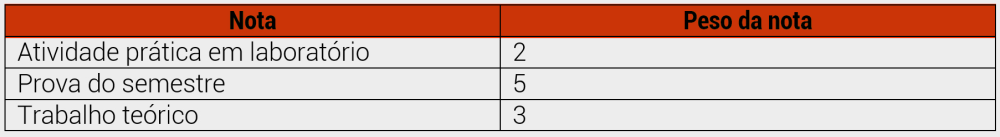
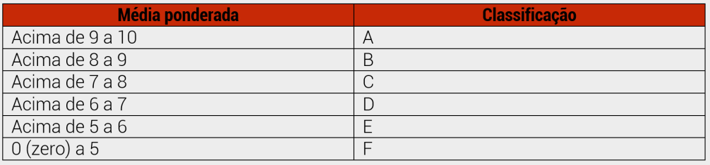
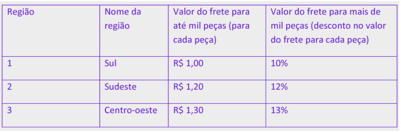

# EngenhariaDeSoftwareII

Primeira lista de exercícios de Javascript

1. Crie uma aplicação para efetuar o cálculo do índice de massa corporal. Considere os seguintes critérios:
I) Ao executar o script a aplicação deve solicitar a entrada do nome da pessoa.
II) Na sequência a aplicação deve solicitar que seja informada a altura da pessoa em centímetros.
III) Na sequência a aplicação deve solicitar que seja informado o peso da pessoa.
IV) Após as estradas de dados, atente-se a conversão das informações para dados do tipo float.
V) Converta a altura recebida em centímetros para metros. (basta dividir a altura por 100).
VI) Internamente a aplicação deve executar o cálculo do índice de massa corporal através da expressão: M = peso (quilos) ÷ altura²
VII) Após identificar o índice de massa corporal o sistema deverá classificar em faixas descritivas utilizando os critérios abaixo:
a) Se M estiver abaixo de 16 : Baixo peso muito grave
b) Se M estiver entre 16 e 16,99: Baixo peso grave
c) Se M estiver entre 17 e 18,49: Baixo peso
d) Se M estiver entre 18,50 e 24,99: Peso normal
e) Se M estiver entre 25 e 29,99: Sobrepeso
f) Se M estiver entre 30 e 34,99: Obesidade grau I
g) Se M estiver entre 35 e 39,99: Obesidade grau II
h) Se M for maior que 40: Obesidade grau III
VIII) Ao término o sistema deve fornecer a seguinte saída para o usuário:
“<Nome> possui índice de massa corporal igual a <m> , sendo classificado como: .” *As informações em vermelho são variáveis e devem ser substituídas pelos seus respectivos valores calculadas dentro da aplicação.
2. Crie uma aplicação capaz de identificar a faixa etária com base na idade informada pelo usuário. Considere os seguintes critérios:
Se a idade informada for maior ou igual a 0 e menor que 15, exibir a mensagem “Criança”. Se a idade informada for maior ou igual a 15 e menor que 30, exibir a mensagem “Jovem”. Se a idade informada for maior ou igual a 30 e menor que 60, exibir a mensagem “Adulto”. Se a idade informada for maior ou igual a 60, exibir a mensagem “Idoso”.
Fique à vontade para utilizar qualquer uma das funções aprendidas para exibição de dados para o usuário.
Um aluno está encontrando dificuldades para entender como é composta a média final de determinada disciplina, a qual é composta pelas três notas seguintes:

Desenvolva uma aplicação em JS que receba as 3 notas, calcule e imprima a média ponderada.
A média ponderada é calculada pela fórmula:
((peso1 * nota1) + (peso2*nota2)+(peso3*nota3))/ (soma dos pesos)
Após concluir a média, o algoritmo deverá classificá-la conforme tabela abaixo.

Ao término, a aplicação deverá gerar como saída:

3. Uma empresa do ramo metalmecânico está realizando uma pesquisa junto a transportadoras para verificar o preço do transporte de seus produtos que serão entregues a seus clientes em outros estados. Ao final da pesquisa, foi selecionada uma transportadora, com a qual foi fechado o transporte dos produtos. O cliente pode selecionar se quer a sua entrega com rastreamento ou não. Assim, deverá ser feita uma pergunta ao cliente. Deseja rastreamento (S-Sim e N-Não)? Se a resposta for “sim”, será cobrada uma taxa de R$ 200,00 pela carga. Cálculo do frete (calcular o valor pelo número de peças transportadas): • Três variáveis influenciam o valor do frete: o número de peças, a região e a distância em quilômetros. • Até mil peças – o valor será conforme a região apresentada na tabela abaixo. O valor é cobrado por cada peça transportada. • Acima de mil peças – valor normal para até mil peças; o número de peças que ultrapassar mil tem desconto conforme a região. Exemplo: Se um cliente comprar 1.200 peças, as quais serão enviados à região 1, que é Sudeste. Será cobrado frete da seguinte forma: para as mil peças, R$ 1,20 cada peça. Para as 200 a mais, será dado um desconto de 12% sobre o valor de R$ 1,20, pagando 1,056 pelo frete de cada peça das 200 restantes. Ficará (1000 * 1.2) + (200* 1.056) = R$ 1.411,20 de frete pelas peças transportadas. A distância para o transporte deve ser informada, pois, para cada quilômetro, é cobrado um litro de combustível, que deverá ser lido ao iniciar o algoritmo. Por questões de logística, a empresa realiza entregas somente para as regiões Sul, Sudeste e Centro-oeste, e cada uma possui um valor de frete com relação à quantidade de peças transportadas, conforme a tabela:

Desenvolva uma aplicação JS que efetue a leitura da distância em quilômetros do frete, a quantidade de peças que serão transportadas, a região (em número) e determine se o cliente quer rastreamento. 
Calcule e imprima o valor final do frete. 
Ao término, devem ser exibidas as seguintes informações: Taxa do rastreamento: 999,99 
Valor do frete pelas peças: 9999.99 
Valor do frete por quilômetro: 999.99 
Total do frete: 999.99 
4. Sabendo que uma rede hoteleira deseja informatizar sua folha de pagamento, desenvolva em pseudocódigo uma solução conforme regras apresentadas pela empresa, de acordo com as especificações abaixo: O funcionário possui os seguintes dados de entrada: código, número de horas trabalhadas no mês, turno de trabalho (M – matutino, V – vespertino ou N – noturno), categoria (F – funcionário, G – gerente). Faça um algoritmo que: - Leia as informações dos funcionários: código (inteiro), número de horas trabalhadas (inteiro) no mês, turno (caractere) e categoria (caractere). Não leia somente o valor da hora trabalhada (real), pois será calculada. - Considere sempre a digitação de uma única letra para representar o turno de trabalho e a categoria do funcionário, conforme as tabelas:

- Calcule o valor da hora trabalhada, conforme as regras apresentadas na tabela a seguir. O valor do salário-mínimo deve ser solicitado pelo algoritmo, pois ele varia de estado para estado e a rede de hotéis está distribuída por todo o País. Utilizar o comando de seleção múltipla (ou um comando escolha e outro pode ser se encadeado – não utilizar se simples para esse item) para testar a categoria e o turno para calcular o valor da hora trabalhada.

- Calcule o salário inicial do funcionário com base no valor da hora trabalhada e no número de horas trabalhadas. - Calcule o valor do auxílio-alimentação recebido pelo funcionário de acordo com seu salário inicial, conforme a tabela a seguir. Utilizar o comando de seleção composto encadeado.

- Imprima como saída o código, número de horas trabalhadas, valor da hora trabalhada, salário inicial, auxílio alimentação e salário final (salário inicial + auxílio-alimentação).

5. Crie uma aplicação para efetuar cálculo aritméticos de soma e subtração.
Considere os seguintes critérios:
I) Ao executar o script a aplicação deve solicitar a entrada de um número, seguido de uma operação de soma ou subtração e posteriormente seguido de um segundo número.
II) A operação deve ser inserida pelo usuário de forma textual, ou seja, quando o sistema solicita a operação o usuário deve informar o texto ‘soma’ ou ‘subtração’ (sem as aspas).
III) Na sequência o sistema deve enviar os parâmetros para uma função efetuar o devido cálculo. Exemplo: calculo(num1, num2, operacao).
IV) A função deve executar o cálculo com base na operação informada pelo usuário e na sequência deve retornar o valor encontrado.
V) Ao término o sistema deve fornecer a seguinte saída para o usuário:
“O resultado é: <resultado>.”
*A informação em vermelho é uma variável e deve ser substituída pelo seu respectivo valor
calculada dentro da aplicação.
6. Faça um script que receba uma data no formato “dd/mm/aaaa” e escreva a data por extenso. Dica: use a função “split” de uma string que quebra a string em pedaços dado um separador como argumento da função. Nesse caso, o separador é a barra (/) da data. Exemplo: Para a entrada “31/08/2012” deve ser escrito “31 de agosto de 2012”.

